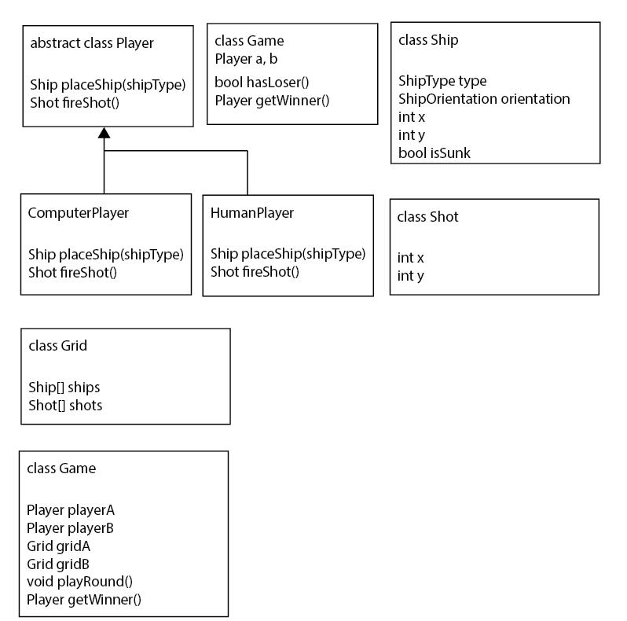
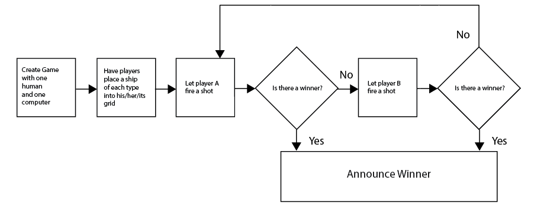

# edu-csci2312
This repository contains the work I completed for the course CSCI2312 Object Oriented Programming at the University of Colorado Denver. I completed this course concurrently with [CSCI2421 Data Structures and Program Design](https://github.com/jake-billings/edu-csci2421).

## Building this Project
This project has no non-standard library dependencies. I wrote a majority of this code using CMake in CLion. However, homework requirements dictate that each assignment must have a working makefile from a standard template distributed at the beginning of the class. Thus, each folder contains a make file. If you have `g++` installed, all you have to do is clone the repository and run make in a directory to build the project. The executable will be place in that directory. I do not include `CMakeLists.txt`.

## Final Project
The most important folder/assignment is the final project. All of the other assignments build towards this project. It is a complete implementation of a human v. CPU game of battleship.




## Documentation
I put a lot of effort into documenting the code in this repository. All functions, variables, blocks, includes, and classes have documentation-style comments detailing the name, type, purpose, and details of the following code.
```C++
/**
 * placeShips()
 *
 * method
 *
 * uses an advanced machine-learning VR blockchain algorithm to place the computer player's ships in its
 *  grid before the game starts
 *
 * "machine-learning VR blockchain algorithm" is a joke.
 *
 * this function does not guarantee its own success
 *
 * it places each shp type sequentially in a random location on the grid. if that spot is not valid, it generates
 *  a new random ship of the same type and tries again
 *
 * after 10,000 tries on one ship type, it assumes the grid is full and gives up; this throws an exception
 *
 * in my testing, this has worked fine (see unit testing in test())
 */
void placeShips() override;
```

## Unit, E2E, and Integration Testing
Starting in HW03, I wrote automated testing for each assignment. Using a few functions as a very basic testing suite, I test the critical functionality of each assignment. I also compare the pros/cons of unit/integration/e2e testing. See the function `test()` in each main file for the testing written for that assignment.
```C++
//---Test WaterVehicle---
describe("WaterVehicle: operator<<: should throw exception reading the header row of the ship_placement.csv file");
err = false;
try {
    WaterVehicle v;
    in >> v;
} catch (invalid_argument e) {
    err = true;
}
failCount += assertInt(true, err);

WaterVehicle v;
string dummy;

//Reset the file and jump to the next line in order
// to test only reading lines from files
in.clear();
in.seekg(0, ios::beg);
getline(in, dummy);

//read row 1 (depends on specific values actually being in the file)
in >> v;
describe("WaterVehicle: operator>>: should read shipType CARRIER from first row of the ship_placement.csv file");
failCount += assertInt(SHIP_TYPE::CARRIER, v.getShipType());
describe("WaterVehicle: operator>>: should read col A from first row of the ship_placement.csv file");
failCount += assertInt(0, v.getX());
describe("WaterVehicle: operator>>: should read row 1 from first row of the ship_placement.csv file");
failCount += assertInt(0, v.getY());
describe("WaterVehicle: operator>>: should read orientation H from first row of the ship_placement.csv file");
failCount += assertInt(SHIP_ORIENTATION::HORIZONTAL, v.getShipOrientation());
```

## Assignments
- HW1: Test of Canvas submission and ROCKET design methodology
- HW2: Grid implemented as a two-dimensional C++ vector 
- HW3: Partial implementation of final project/C++ grids
- HW4: Design research/documentation in preparation for final project
- HW5: Inheritance/Polymorphism with exception handling + IO
- HW7
- HW8
- HW9
- FINAL PROJECT: Full implementation of the game Battleship with human vs. artificial intelligence


### Other Projects ###
Checkout my other projects at [http://www.jakebillings.com](http://www.jakebillings.com) or contact me via [LinkedIn](https://www.linkedin.com/in/jake-billings/).